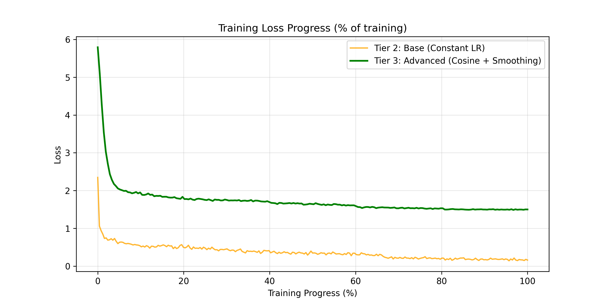
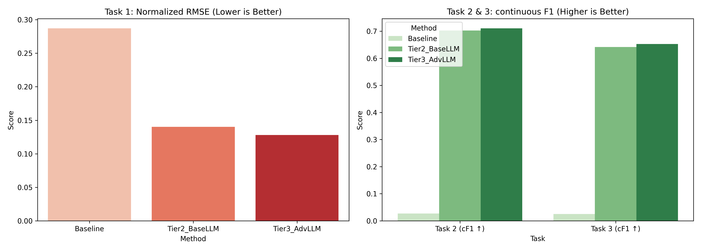
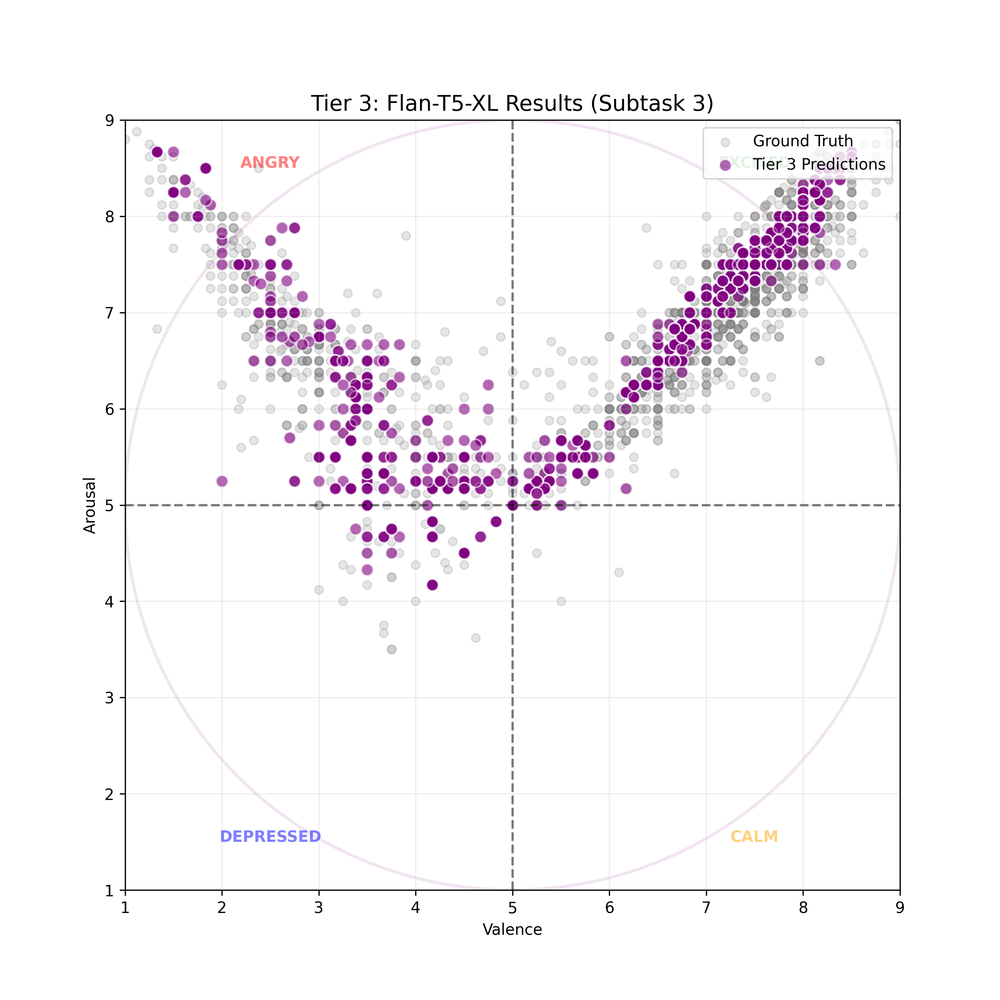

# Subtask 1: DimABSA Track A

Dimensional Aspect-Based Sentiment Analysis (DimABSA) maps sentiment into a continuous 2D Valence-Arousal (VA) space. Subtask 1 extracts Aspect terms from text and predicts their continuous VA scores (1.0 to 9.0). We treat this regression problem as a Sequence-to-Sequence generation task using `google/flan-t5-xl`.

## Results

The generative model outperforms the heuristic baseline across all subtasks. Beam Search and Repetition Penalty enforce formatting constraints and improve extraction accuracy.

| Method        |   Task 1 (RMSE ↓) |   Task 2 (cF1 ↑) |   Task 3 (cF1 ↑) |
|:--------------|------------------:|-----------------:|-----------------:|
| Baseline      |            0.2872 |           0.027  |           0.0248 |
| Tier2_BaseLLM |            0.1402 |           0.7028 |           0.6417 |
| Tier3_AdvLLM  |            0.1281 |           0.7108 |           0.6528 |







## How to Run

1. **Clone the repository**
   ```bash
   git clone https://github.com/awesomeslayer/Transformers2026.git
   cd Transformers2026/1
   ```

2. **Build the Docker image**
   ```bash
   ./build
   ```

3. **Launch the container**
   ```bash
   ./launch_container
   ```

4. **Execute the notebook**
   Open `http://localhost:8881` in your browser. The launch script disables the token requirement. Open `DimABSA.ipynb`. Run all cells.

The code saves prediction `.jsonl` files to the `results/` directory for CodaBench submission.